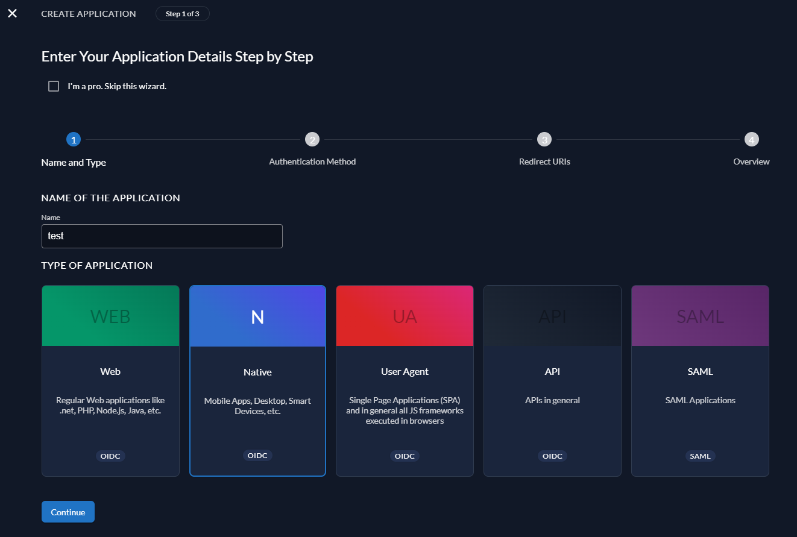
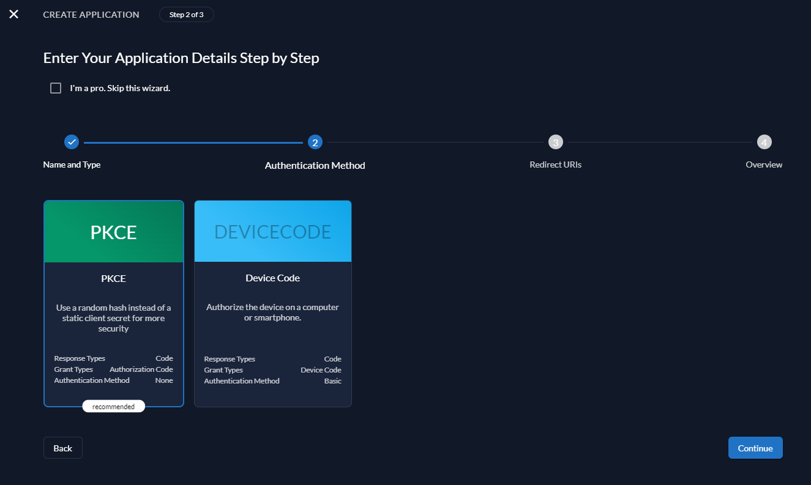
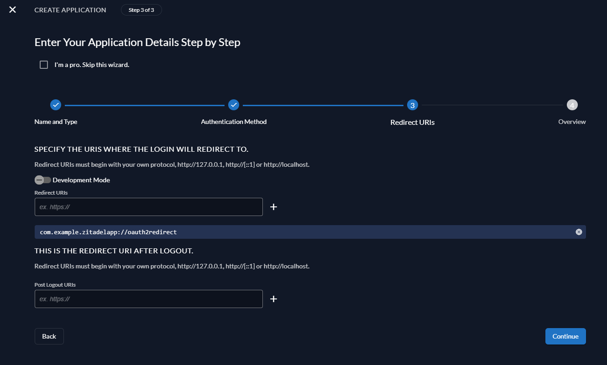
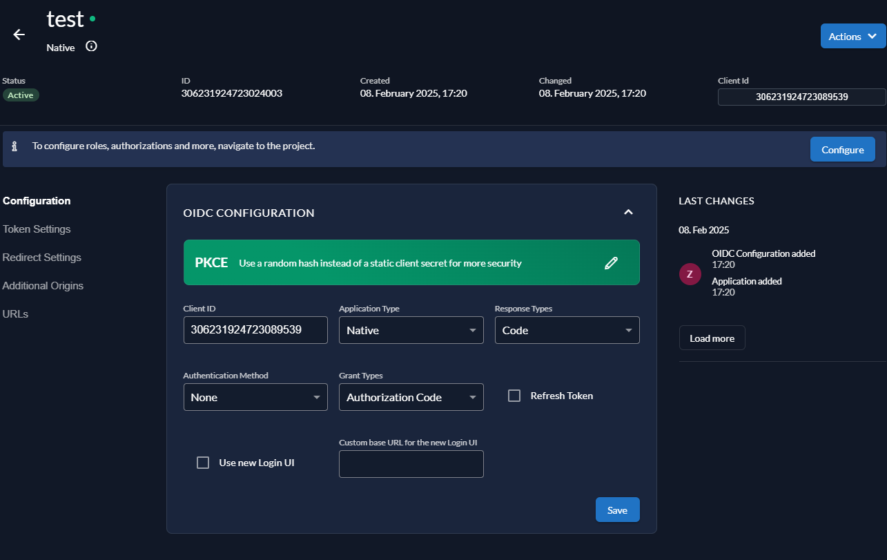

# Zitadel Demo App

This repository contains a demo Android application written in Kotlin that demonstrates native integration with Zitadel. The app uses the AppAuth library with PKCE and Custom Tabs to perform authentication, token exchange, and user information retrieval from Zitadel.

Repository URL: [https://github.com/Fascinat0r/KotlinZitadelDemo](https://github.com/Fascinat0r/KotlinZitadelDemo)

---

## Описание (Русский)

Это демо-приложение на Kotlin для Android, демонстрирующее интеграцию с Zitadel посредством протокола PKCE. Приложение использует библиотеку [AppAuth for Android](https://github.com/openid/AppAuth-Android) вместе с Custom Tabs для безопасного открытия браузера, выполнения запроса авторизации, обмена authorization code на access token и последующего запроса данных пользователя (userinfo).

### Основные возможности:

- **Аутентификация с Zitadel:** Реализована аутентификация через AppAuth с поддержкой PKCE.
- **Использование Custom Tabs:** Открытие внешнего браузера через Custom Tabs для безопасного проведения аутентификации.
- **Обмен токена:** Обработка обмена authorization code на access token с помощью AppAuth.
- **Запрос userinfo:** Получение и отображение данных пользователя с использованием Ktor.
- **Подробное логирование:** На каждом этапе аутентификации ведется логирование для отладки.

### Технологии:

- Kotlin
- AppAuth for Android
- Custom Tabs (androidx.browser)
- Ktor (для сетевых запросов)
- kotlinx.serialization

### Предварительные требования:

- **Android Studio** (рекомендуется версия Arctic Fox и выше)
- **Устройство или эмулятор** с Android 7.0+ (minSdk 24, на других не проверялось)
- **Настроенный проект в Zitadel:** Зарегистрированное приложение с redirect URI `com.example.zitadelapp://oauth2redirect`.

---

## Инструкция по настройке Zitadel

1. **Перейти в организацию и создать проект**, если его ещё нет.
   
2. **Создать "Application" и выбрать Native:**

   

3. **Выбрать PKCE в настройках авторизации:**

   

4. **Указать Redirect URI:**

   Введите `com.example.zitadelapp://oauth2redirect` в поле Redirect URI.  
   Не забудьте нажать на **плюсик** справа от поля ввода, чтобы добавить URI, и только потом нажмите "Continue".

   

5. **Проверить данные и нажать Create.**

6. **После создания в финальном окне "Application" скопируйте Client ID и используйте эндпоинты из раздела URLs:**

   

---

## Установка и запуск:

1. **Клонирование репозитория:**
   ```bash
   git clone https://github.com/Fascinat0r/KotlinZitadelDemo.git
   ```
2. **Открытие проекта:** Откройте проект в Android Studio.
3. **Проверка конфигурации:** Убедитесь, что в файлах `AndroidManifest.xml` и `build.gradle.kts` указаны корректные значения для redirect URI и manifestPlaceholders:
   ```kotlin
   manifestPlaceholders["appAuthRedirectScheme"] = "com.example.zitadelapp"
   ```
4. **Сборка и запуск:** Соберите и запустите приложение на устройстве или эмуляторе.
5. **Аутентификация:** Нажмите кнопку "Login" для начала процесса аутентификации. После успешного входа приложение отобразит полученный access token и данные пользователя.

---

## Description (English)

This repository contains a demo Android application written in Kotlin that demonstrates native integration with Zitadel using PKCE. The app leverages the [AppAuth for Android](https://github.com/openid/AppAuth-Android) library along with Custom Tabs to securely launch the browser for authentication, perform the authorization request, exchange the authorization code for an access token, and then retrieve user information (userinfo) from Zitadel.

Repository URL: [https://github.com/Fascinat0r/KotlinZitadelDemo](https://github.com/Fascinat0r/KotlinZitadelDemo)

### Key Features:

- **Zitadel Authentication:** Implemented via AppAuth with PKCE support.
- **Custom Tabs Integration:** Uses Custom Tabs to securely open an external browser for authentication.
- **Token Exchange:** Handles the exchange of the authorization code for an access token using AppAuth.
- **Userinfo Request:** Retrieves and displays user data using Ktor.
- **Detailed Logging:** Logs every step of the authentication process for debugging purposes.

### Technologies:

- Kotlin
- AppAuth for Android
- Custom Tabs (androidx.browser)
- Ktor (for network requests)
- kotlinx.serialization

### Prerequisites:

- **Android Studio** (recommended version Arctic Fox or later)
- **A device or emulator** running Android 7.0+ (minSdk 24)
- **A configured Zitadel project:** A registered application with the redirect URI `com.example.zitadelapp://oauth2redirect`.

---

## Setting Up Zitadel

1. **Navigate to your organization and create a project** if one doesn't exist.

2. **Create an "Application" and select Native:**

   

3. **Select PKCE as the authentication method:**

   

4. **Set the Redirect URI:**

   Enter `com.example.zitadelapp://oauth2redirect` in the Redirect URI field.  
   Don't forget to click the **plus button** next to the field to add the URI before clicking "Continue".

   

5. **Review the data and click Create.**

6. **From the final "Application" window, copy the Client ID and note the URLs for all endpoints:**

   

---

## Installation and Running:

1. **Clone the repository:**
   ```bash
   git clone https://github.com/Fascinat0r/KotlinZitadelDemo.git
   ```
2. **Open the project:** Open the project in Android Studio.
3. **Verify configuration:** Ensure that `AndroidManifest.xml` and `build.gradle.kts` contain the correct redirect URI settings and manifest placeholders:
   ```kotlin
   manifestPlaceholders["appAuthRedirectScheme"] = "com.example.zitadelapp"
   ```
4. **Build and run:** Build and run the application on your device or emulator.
5. **Authenticate:** Tap the "Login" button to start the authentication process. After successful login, the app will display the received access token and user information.

---

## License

This project is licensed under the [MIT License](LICENSE).